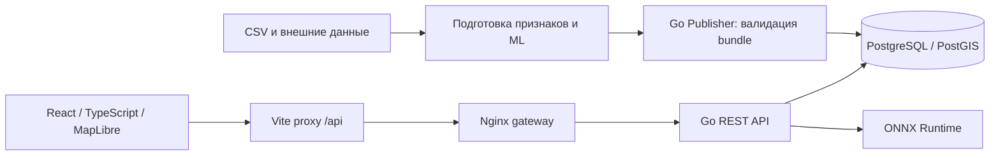

# TramFlow — прогноз загрузки трамвайных маршрутов

Проект для задачи «ИИ-прогноз загрузки трамвайных маршрутов». Backend на Go принимает подготовленные данные, выполняет прогноз через ONNX-адаптер, агрегирует посадки и рассчитывает сценарии. Исходный frontend на React/TypeScript показывает маршруты, карту и временные графики.

**Начать здесь: [пошаговый запуск](docs/LAUNCH.md).** В текущей версии backend запускается через Docker Compose, frontend — отдельно через Vite. Сайт открывается на **http://localhost:5173**, API — на **http://localhost:8080**.

## Возможности

- Маршрутные прогнозы по часам и дням; календарные периоды day/week/month/custom в пределах покрытия snapshot.
- Серверные сценарии выпуска и коэффициентов погоды, события и сезона. Это ручные поправки к baseline, а не оценка причинного влияния.
- GeoJSON маршрутов, согласованные summary и CSV-экспорт.
- Авторизация через серверную сессию и HttpOnly cookie.
- Версионирование модели, данных и сети; проверка bundle до активации.
- Импорт 15-минутного route-flow CSV с проверкой дублей, суммы категорий и полноты часов.
- Получение почасовой погоды Open-Meteo; повторение occupancy-профиля 2025 по месяцу, дню и часу для других годов.

Фронт восстановлен из первоначального архива команды. Добавленный ранее редактор коэффициентов удалён при откате: наличие сценарного API не означает, что все его возможности доступны в текущем интерфейсе.

## Архитектура и стек

Go 1.26.8, PostgreSQL 16/PostGIS, ONNX Runtime 1.24.1, React, TypeScript, MapLibre, Docker Compose. Конфигурации Prometheus/Grafana находятся в deploy; их запуск описан отдельно.

## Структура

| Путь | Назначение |
|---|---|
| backend/ | Go API, Publisher, inference, миграции и команды импорта |
| frontend/ | Первоначальный frontend команды |
| compose.yaml | Backend, база, seed и API gateway |
| deploy/ | Nginx и конфигурации мониторинга |
| docs/ | Архитектура, запуск и материалы для отчёта |
| docs/benchmark/ | Переданный нагрузочный отчёт, исходные результаты и графики |
| integration/ | Фикстуры и материалы предыдущей интеграции |

Для запуска используйте каталог frontend, а не смешивайте его зависимости с package.json в корне. Старый INTEGRATION_README.md относится к версии до отката фронта и не заменяет актуальный [гайд](docs/LAUNCH.md).

## Документация

- [Запуск и диагностика](docs/LAUNCH.md).
- [Архитектура](docs/ARCHITECTURE.md).
- [Backend и API](backend/README.md), [OpenAPI](backend/openapi/openapi.yaml).
- [Подключение ML и эталонных векторов](backend/docs/ML_HANDOFF.md).
- [Внешние признаки: Open-Meteo и occupancy](backend/docs/ML_EXTERNAL_INPUTS.md).
- [Приём route-flow данных](docs/CRITERION_COEFFICIENTS.md). Часть документа про автоматические коэффициенты описывает версию до отката frontend.
- [Текст для шести полей отчётной формы](docs/SUBMISSION_FORM.md).
- [Benchmark PDF](docs/benchmark/Tramflow_Benchmark_Report.pdf), [таблица результатов](docs/benchmark/summary.md), [происхождение и границы измерений](docs/benchmark/provenance.json).

## Производительность

В переданном отчёте пять коротких HTTP-запусков по 5000 запросов: **25000 запросов, ошибок 0**. Максимум — **662,64 запроса/с** при concurrency=24, p95=46,555 мс. При concurrency=16 — 660,52 запроса/с, p95=33,522 мс, p99=40,510 мс.

Это измерения API напрямую на synthetic snapshot, длительность отдельного запуска около 7,5–8,8 с. Они не подтверждают ML-качество, длительную устойчивость, производительность всей цепочки с frontend или эквивалентность текущей сборке. Условия и исходные данные сохранены в docs/benchmark.

## Статус модели и demo

Стандартный Docker seed использует явно синтетические данные и тестовый ONNX. Это проверка API, а не реальный прогноз Москвы. Переданы веса трёх глобальных LightGBM и 27 маршрутных CatBoost; согласовано смешивание 25% / 75%. Полное подключение этого ансамбля и независимая оценка WAPE/RMSE пока не подтверждены. Публичную ссылку на веса, ML notebook, исходные CSV и инструкции следует добавить в ML-поставку.

Остановочные прогнозы не получаются копированием маршрутного значения: необходимы отдельные данные и подтверждённое покрытие. UI должен учитывать capabilities backend.

## Работа с репозиторием

Основная совместная ветка — dev. Изменения выполняются в feature/<feature_name>, затем проходят PR и ревью в dev. После проверок итоговая dev переносится в main. Пароли из .env и локальные ML-артефакты не добавляются в Git.
