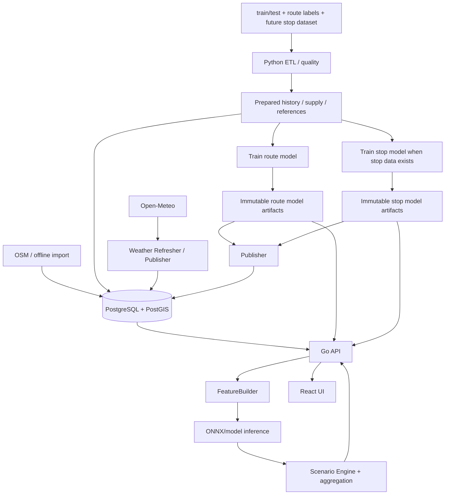

# Архитектура v1.2

## 1. Зафиксированные решения

| Решение | Статус |
|---|---|
| PostgreSQL + PostGIS — authoritative runtime storage | Зафиксировано |
| ONNX/model artifacts — immutable files/object storage | Зафиксировано |
| Route model прогнозирует `boardings` по route/date/hour | Зафиксировано по labels/submission |
| Stop forecast — отдельный first-class ML scope, когда появятся stop-level данные | Зафиксировано |
| Scenario Engine — формулы, не вторая ML-модель | Зафиксировано |
| Режимы UI: day / week / month / custom | Зафиксировано |
| `custom` — только дневная детализация | Зафиксировано |
| Day — 24 hourly frames и локальная рулетка без HTTP на каждый шаг | Зафиксировано |
| Погода — Open-Meteo через pinned snapshots | Зафиксировано |
| MapLibre + PostGIS geometry | Зафиксировано |
| Подходящие столбики перед остановкой — decorative frontend effect | Зафиксировано |
| UI indicators получают `variant` от backend | Зафиксировано |
| Auth — server-side session + HttpOnly cookie | Зафиксировано |

## 2. Системная схема



## 3. Runtime source of truth

```text
PostgreSQL + PostGIS
├── routes
├── route_patterns
├── stops
├── route_stops
├── route/supply profiles
├── route reference profiles
├── stop reference profiles
├── aggregated history required by runtime
├── weather snapshots / prepared external features
├── forecast_snapshots
├── active snapshot pointer
├── route model/version metadata
├── stop model/version metadata
├── source/version metadata
├── user sessions
└── operational metadata

Immutable artifacts
├── route_boardings.onnx
├── route_feature_schema.json
├── route_model_manifest.json
├── route_golden_vectors.json
├── stop_boardings.onnx              # когда stop model готова
├── stop_feature_schema.json
├── stop_model_manifest.json
└── stop_golden_vectors.json
```

PostGIS:

```text
route_patterns.geometry  geometry(LineString/MultiLineString, 4326)
stops.location           geometry(Point, 4326)
route_stops              route_pattern_id + stop_id + sequence
```

Cache miss всегда приводит к чтению из PostgreSQL и/или детерминированному пересчёту. Process-local cache не является registry.

## 4. Snapshot consistency

`forecast_snapshot_id` фиксирует согласованный набор:

```text
model_version
feature_schema_version
stop_model_version?              # required when stop forecasts are exposed
stop_feature_schema_version?
history_version
weather_snapshot_id
supply_profile_version
reference_version
scenario_policy_version
network_version
forecast_origin_at
observations_complete_through
```

Snapshot registry и active pointer находятся в PostgreSQL. Незавершённый snapshot API не видит.

Активация атомарна:

```text
BEGIN
  insert + validate new snapshot metadata
  mark new snapshot active
  deactivate previous snapshot
COMMIT
```

При ошибке публикации предыдущий active snapshot продолжает обслуживаться.

## 5. Publisher / Weather Refresher

```text
fetch / build
   ↓
validate
   ↓
persist prepared version to PostgreSQL
   ↓
persist immutable model artifact if needed
   ↓
create snapshot metadata
   ↓
atomically activate snapshot
```

Publisher запускается одним экземпляром либо использует PostgreSQL advisory lock. Отдельный distributed lock service не нужен.

## 6. Route и stop forecast scopes

Route prediction — обязательный scope и официальный конкурсный target.

Stop prediction — отдельный ML output:

```text
route_id
route_pattern_id
route_stop_id
stop_id
frame/window
boardings_prediction
load_index
```

Он не строится копированием route-level значения. Когда stop model ещё не опубликована:

```text
capabilities.stop_forecasts = false
coverage.stop_forecast_status = unavailable
```

и `spatial_detail=route_stop` получает `422`.

Когда модель опубликована, stop values приходят как `RouteReading.stop_readings[]` и качество stop-модели измеряется отдельно от официального route WAPE.

## 7. Карта и визуальные эффекты

Backend отдаёт:

- route/stops geometry из PostGIS;
- реальные `stop_readings`;
- `VisualizationPolicy`.

Frontend рисует колонку в координате остановки. Декоративная цепочка/градиент примерно за 20 м до остановки строится из **того же одного stop value**. Это не массив дополнительных измерений и не segment forecast.

```text
StopReading(load_index=0.82)
          ↓
      [decorative ramp]
   ▂ ▄ ▆ █ ● stop
```

`segment_forecasts=false` в v1.2.

## 8. UI indicators и summary

Backend формирует `UiIndicator`:

```text
key + variant + tone + icon + title + text
```

`variant` определяет точное состояние (`rain`, `clear`, `up`, `down`, `deficit` и т.д.). Frontend не разбирает `title/text` и не вычисляет причинность.

Summary — синхронная детерминированная операция над тем же `CalculationDescriptor` и `calculation_id`.

## 9. Временные режимы

```text
DAY
  one local calendar day
  resolution=hour
  frontend получает все hourly frames и крутит wheel локально

WEEK
  exactly 7 local days
  resolution=day

MONTH
  one local calendar month
  resolution=day

CUSTOM
  arbitrary local-date range
  resolution=day only
  max length = bootstrap.limits.max_custom_days
```

Custom может пересекать конец месяца, год и 29 февраля. Backend не делает silent clipping.

## 10. Horizontal scaling

```text
                   ┌── Go API #1 ── bounded cache
Load Balancer ─────┼── Go API #2 ── bounded cache
                   └── Go API #N ── bounded cache
                          │
                          ▼
                  PostgreSQL/PostGIS
                          │
                          ▼
                 immutable ML artifacts
```

Sticky sessions не нужны: browser session authoritative хранится в PostgreSQL. Все API-реплики видят один active snapshot.

## 11. Ограничения

- `boardings` не равен числу людей одновременно в салоне;
- `load_index` — нормированная интенсивность, не физическая occupancy;
- stop forecast требует отдельного stop-level data/model pipeline;
- декоративный approach effect не является прогнозом участка;
- `required_vehicle_count` — what-if оценка, не диспетчерская команда.
