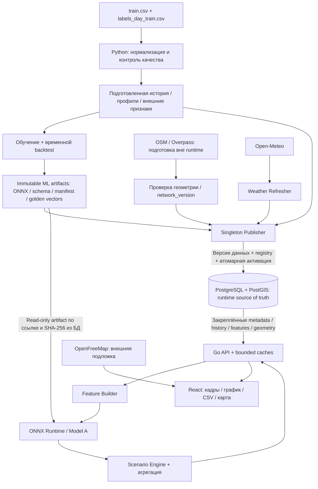

# Архитектура v1

> Редакция хранения: PostgreSQL/PostGIS, 2026-09-26. Публичный HTTP-контракт v1.0.0 и нормативные формулы сохранены.

## 1. Зафиксированные решения и их основания

| Решение | Основание |
|---|---|
| Одна ML-модель прогнозирует `boardings` по маршруту и часу | Заголовки labels и submission, предоставленные командой |
| ONNX inference выполняется на backend | Решение команды; в исходном ТЗ ONNX — один из рекомендованных вариантов |
| Scenario Engine — формулы, не вторая ML-модель | Последнее согласованное решение |
| День / неделя / месяц, без года | Уточнение экспертов, переданное командой |
| `place_id` не используется как остановка | Предоставленный словарь данных |
| Остановки на карте — географический справочник без числового прогноза | Отсутствуют остановочные labels и координаты событий |
| Внешняя погода — Open-Meteo, предварительно сохранённая | Решение команды |
| MapLibre + OpenFreeMap; подготовленная геометрия в PostGIS, API отдаёт GeoJSON | Уточнённое решение команды |
| PostgreSQL + PostGIS — обязательное operational/runtime хранилище и source of truth | Последнее зафиксированное решение команды |
| Immutable ML-артефакты остаются файлами; ONNX не хранится BLOB в PostgreSQL | Разделение operational data и model artifacts |
| Go — базовый backend | Ранее согласованный стек команды; HTTP-контракт не зависит от языка |
| Никаких LLM, публичного ML RPC, пользовательских сессий и сохранённых evaluations в P0 | Эти функции не нужны текущему интерфейсу |

Исходное ТЗ и уточнения команды не следует смешивать: отказ от года подтверждён сообщением команды, не новым документом организаторов. `SOURCES.md`, упоминавшийся в полном пакете, отсутствует в переданном семифайловом архиве; здесь он не восстановлен по догадкам.

## 2. Компоненты



Модель работает на backend, но **не на каждом движении рулетки**. Запрос вычисляет пакет часов. Frontend переключает уже полученные кадры.

## 3. Границы runtime

### Go API

Внутри одного процесса:

- HTTP: схемы, лимиты, ошибки, привязка к snapshot.
- `SnapshotRegistry`: чтение registry и active pointer из PostgreSQL.
- `HistoryRepository`, `ProfileRepository`, `WeatherRepository`: чтение подготовленных данных из PostgreSQL по версиям закреплённого snapshot.
- `FeatureBuilder`: сборка числового вектора строго по manifest.
- `BoardingsModel`: адаптер ONNX Runtime; immutable модель загружается из filesystem по метаданным БД.
- `ForecastService`: пакетное вычисление и ограниченный кэш базовых прогнозов.
- `ScenarioEngine`: чистые функции над часовыми результатами.
- `AggregationService`: суммы и отношения по заданному интервалу.
- `RouteCatalog`: маршруты, остановки, `route_stops` и геометрия из PostgreSQL/PostGIS.
- `CsvExporter`: повтор того же расчёта и ограниченный CSV.

In-memory структуры — только bounded caches и загруженные ONNX-сессии. Они не являются registry и не содержат единственную копию runtime-данных.

На пользовательском пути нет чтения сырых CSV, обучения модели, Overpass, Open-Meteo или LLM-запроса. PostgreSQL читается для закреплённого snapshot; cache miss приводит к чтению и детерминированному пересчёту.

### Python offline

Читает исходные файлы, проверяет их семантику, готовит агрегаты и профили, обучает модель, оценивает её и экспортирует immutable ML-артефакты. Подготовленные runtime-данные передаются Publisher для импорта в PostgreSQL.

CSV, Parquet и DuckDB допустимы в offline ETL/ML, но не заменяют PostgreSQL как runtime source of truth. Все сырые транзакции переносить в operational БД не требуется. Соревновательный submission — отдельная команда этого контура.

### Publisher / Weather Refresher

Внутренняя задача, не публичная API-ручка:

```text
fetch / build new data
        ↓
validate
        ↓
persist prepared data/version into PostgreSQL
        ↓
persist and verify immutable artifacts, if needed
        ↓
create complete forecast snapshot
        ↓
atomically activate snapshot in PostgreSQL
```

Базовый вариант P0 — один Publisher/Weather Refresher на развёртывание. Он может быть отдельным процессом либо фоновым модулем ровно одного назначенного экземпляра Go. Обычные API-реплики самостоятельно публикации не выполняют.

Подготовка и внешние загрузки проходят **до короткой транзакции активации**. Сбой обновления оставляет предыдущий active snapshot рабочим. Обучение при изменении пользовательского коэффициента не запускается.

## 4. Хранилище

### 4.1. PostgreSQL + PostGIS — обязательный runtime source of truth

```text
PostgreSQL + PostGIS
├── routes / route_patterns / stops / route_stops
├── network versions and geometry
├── route/supply profiles
├── load references / scenario policy versions
├── aggregated historical data needed by runtime
├── weather snapshots / prepared external features
├── forecast snapshot metadata and registry
├── active snapshot pointer
├── model / feature-schema version metadata
└── data-source / quality / other operational metadata
```

Названия в схеме — логические сущности, не готовая SQL-миграция. Все входы, от которых зависит расчёт, получают версию. Опубликованные версии данных не изменяются на месте: исправление истории, погоды, профиля или сети создаёт новую версию и новый snapshot.

`forecast_snapshots` хранит согласованный набор ссылок на версии. Отдельная singleton-запись `active_forecast_snapshot` хранит указатель на текущий опубликованный snapshot. Метаданные модели содержат ссылку на immutable артефакт и его SHA-256, а не бинарное содержимое ONNX.

Базовый прогноз при необходимости сохраняется в БД как **производный кэш**, но обязательной таблицы сохранённых пользовательских сценариев/evaluations нет. Источником истины для повторного вычисления остаются закреплённые входы и модель.

### 4.2. PostGIS и географические сущности

```text
routes.geometry    geometry(LineString, 4326)
stops.location     geometry(Point, 4326)
```

Сущности привязаны к `network_version`. `route_stops` сохраняет связь физической остановки с направлением/вариантом маршрута, её `route_stop_id` и `sequence`. Повторное посещение одной остановки не схлопывается.

Варианты и направления остаются отдельными сущностями `route_patterns`; их геометрия должна сохранять различия, предусмотренные текущим GeoJSON-контрактом. Несвязанные части маршрута нельзя искусственно соединять в одну линию ради типа `LineString`.

Overpass/GeoJSON — способ подготовки и импорта, а не альтернативный runtime registry. После проверки геометрия импортируется в PostGIS. Endpoint карты читает **запрошенную версию** из БД и формирует прежний GeoJSON; его локальная копия допустима только как кэш.

PostGIS обеспечивает хранение географии и необходимую геопривязку там, где есть исходные координаты/связи. Он **не восстанавливает отсутствующие остановочные посадки**: `place_id` остаётся кодом депо.

### 4.3. Immutable artifacts / filesystem

```text
/artifacts/models/<model_version>/
├── boardings.onnx
├── feature_schema.json
├── model_manifest.json
├── golden_vectors.json
├── quality.json
└── training-config.json

/artifacts/static/<artifact_version>/
└── optionally large/prepared static artifacts
```

ML/model artifacts сохраняются immutable. ONNX, golden vectors и все build artifacts не требуется помещать внутрь PostgreSQL. Если часть крупного подготовленного статического материала остаётся файлом, БД хранит его version/path/checksum; файл доступен всем обслуживающим репликам до активации snapshot. Это не допускает второго независимого registry.

**`/data/current.json` больше не используется как главный registry или active pointer.** Файловый manifest может описывать содержимое поставки модели, но не выбирает активный runtime snapshot.

### 4.4. Local cache

Кэши ограничены памятью и привязаны к snapshot/версиям. При промахе API читает PostgreSQL, загружает требуемый immutable artifact при подготовке соответствующей ONNX-сессии и/или повторяет детерминированный расчёт.

Промах кэша сам по себе не является `404`, `410` или отсутствием forecast. Ошибки существования определяются registry в БД. Недоступность БД или обязательного артефакта — эксплуатационная ошибка, а не разрешение перейти на локальный файловый registry.

## 5. Согласованность версий

Snapshot по-прежнему закрепляет:

```text
model_version
feature_schema_version
history_version
weather_snapshot_id
supply_profile_version
reference_version
scenario_policy_version
network_version
forecast_origin_at
observations_complete_through
```

Изменение любого из этих входов требует нового `forecast_snapshot_id`. Перенос хранения в PostgreSQL не меняет значения и семантику этих полей публичного API.

### Подготовка и атомарная активация

Кандидат до публикации проходит проверки полноты/покрытия, доступности истории и погоды на origin, контрольных сумм, model/schema compatibility и golden vectors. Внутреннее состояние подготовки не выдаётся как опубликованный snapshot.

Упрощённая транзакционная схема:

```text
BEGIN
  exclude concurrent activation for this publication slot
  verify expected previous active snapshot
  insert/validate complete forecast snapshot metadata and version references
  record deactivation of the previous snapshot
  set active_forecast_snapshot to the new snapshot
COMMIT
```

Используем **один указатель**, а не два независимо изменяемых флага `is_active`. Его переключение и служебные метаданные деактивации происходят в одной транзакции. Незавершённый snapshot не выдаётся API даже при прямом запросе его ID.

Файловый артефакт должен быть окончательно записан, проверен и доступен **до COMMIT активации**. PostgreSQL-транзакция не считается транзакцией файловой системы. При сбое до активации могут остаться неиспользуемые подготовленные файлы/версии, но старый active pointer не меняется.

### Чтение и удержание версий

`bootstrap` получает active pointer и соответствующие metadata согласованно из PostgreSQL. После выбора snapshot весь расчёт читает только его version IDs; повторно разрешать «current» посередине запроса запрещено. Смена active snapshot не перенастраивает незавершённый запрос.

Старые снимки и все необходимые для их воспроизведения версии/артефакты обслуживаются минимум 24 часа после деактивации и не меньше срока, объявленного API. Активный snapshot не удаляется. Общие версии нельзя удалить, пока они нужны другому обслуживаемому snapshot. Очистка также учитывает уже выполняющиеся запросы.

Метаданные удаления/tombstone сохраняются, чтобы отличать известный удалённый снимок (`410`) от неизвестного (`404`). Новая версия автоматически не подставляется.

`calculation_id` — хеш запроса и закреплённого контекста, **не запись в БД**. Для экспорта передаётся полный descriptor. Поэтому результат воспроизводится после очистки кэша и на другой API-реплике.

## 6. Горизонтальное масштабирование

```text
                       ┌── Go API #1 ──┐
Load Balancer ──────────┼── Go API #2 ──┼──► PostgreSQL + PostGIS
                       └── Go API #N ──┘       │
                              │               └── registry / versions /
                              │                   active snapshot / runtime data
                              ▼
                 shared read-only immutable ML artifacts
```

Все экземпляры Go API используют **один PostgreSQL/PostGIS как authoritative storage** и один active pointer. Файлы моделей читаются самими API по проверенным ссылкам из БД; PostgreSQL не выполняет ONNX inference.

Sticky sessions не нужны. У каждой реплики собственный bounded cache; запрос с тем же descriptor и snapshot воспроизводим на любой готовой реплике.

P0: один Publisher с правом записи, API-реплики читают runtime-данные. Если возможны конкурирующие запуски Publisher, допустима PostgreSQL advisory lock для финальной транзакции активации вместе с уникальностью version/snapshot ID и проверкой ожидаемого active pointer. Эта блокировка не заменяет проверки и не означает, что внешняя загрузка должна идти внутри долгой транзакции. Отдельный distributed lock service не нужен.

Модели доступны через общий read-only volume либо заранее доставлены и проверены на каждой обслуживающей реплике. Реплика без требуемой версии модели не готова обслуживать её и не должна незаметно использовать предыдущую модель. Проверка готовности описана в `BACKEND.md`.

Развёртывание включает API и обязательный PostgreSQL/PostGIS как отдельную инфраструктурную зависимость; ML artifacts подключаются отдельно. Лимиты и измерения ресурсов API и БД отражаются раздельно. Наличие отдельной БД не выдаётся за соблюдение ограничения «весь продукт в одном контейнере».

## 7. Отказоустойчивость

| Сбой | Поведение |
|---|---|
| Open-Meteo недоступен / обновление не прошло validation | Не активировать кандидата; предыдущий snapshot продолжает обслуживаться с закреплённой погодой/fallback |
| Ошибка Publisher до COMMIT | Rollback активации; старый active pointer не изменяется |
| PostgreSQL недоступен | Readiness `503`; не переходить на `/data/current.json`. Запрос, который не может проверить registry/прочитать обязательные входы, получает `503`, не `404` |
| OpenFreeMap недоступен | Локальный фон + геометрия из API/уже загруженного кэша; прогнозы не зависят от подложки |
| Новый ONNX не прошёл smoke/golden test | Не активировать новый snapshot |
| Обязательный artifact опубликованной версии недоступен | Явная неготовность/`503`; не подставлять другую модель |
| Требуемая геометрия не подготовлена | Явная недоступность карты маршрута; не выдумывать линию |
| Нет оценки выпуска | `SUPPLY_UNKNOWN`; `boardings` доступен, индекс — нет |
| Нет эталона интенсивности | `REFERENCE_MISSING`; не заменять нулём |
| Переполнена очередь inference / исчерпан допуск к БД | `429` или `503` по причине перегрузки, без неограниченной очереди |
| Превышен срок обработки | `504`, без частичного результата |

После сбоя обновления старый snapshot остаётся рабочим при доступности его БД-данных и артефактов. Это не обещание автономной работы при отказе самого PostgreSQL.

## 8. Что не заявляем

Нет доказанной оценки заполненности салона, оптимизации расписания, пассажиропотока через перегон и полного фактического выпуска. Нет подтверждённых RPS/latency без замеров. Есть архитектура для этих замеров, а не обещание, что ONNX «в любом случае быстрый».

Эта редакция изменяет документацию хранилища и публикаций. SQL-миграции, PostgreSQL repositories, реальный Publisher и интеграционные тесты PostgreSQL/PostGIS должны быть реализованы в backend; их наличие не следует из этих документов.
