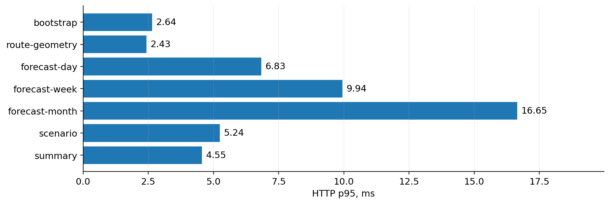
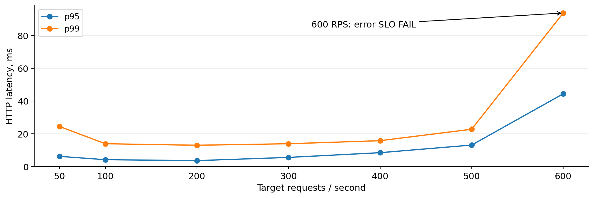
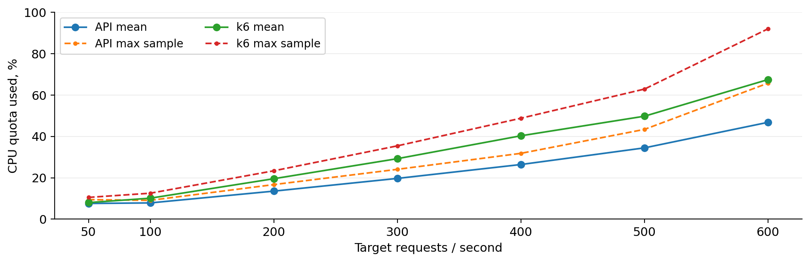
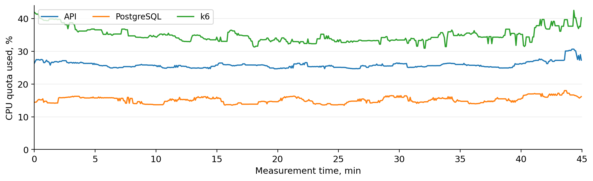
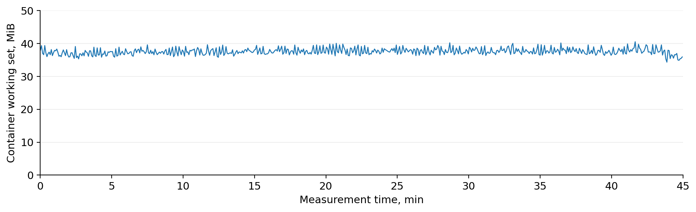
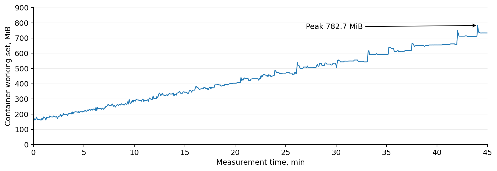
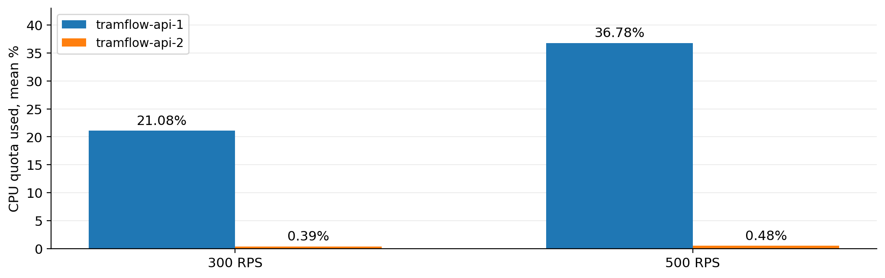
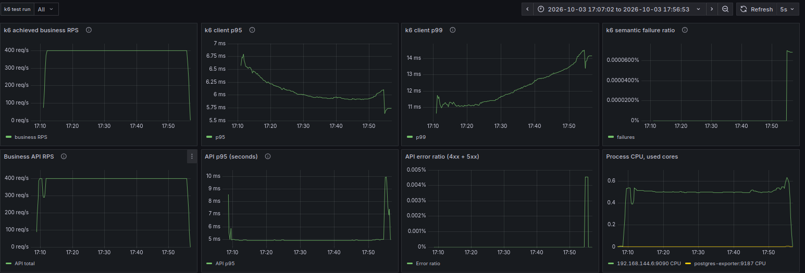
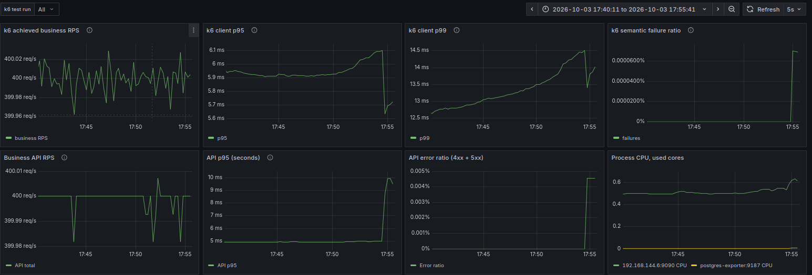
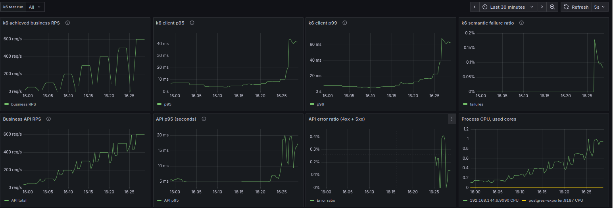

# TramFlow
## Нагрузочное тестирование API
### Итоговый отчёт · 3 октября 2026

**400 RPS в течение 45 минут**

**1 080 000 успешных запросов · p95 9,15 мс · p99 16,98 мс**

Длительный смешанный прогон завершился в пределах заданных критериев: из 1 080 001 бизнес-запроса один не прошёл проверку, пропущенных итераций нет. Это подтверждённая рабочая точка данного стенда, а не универсальный предел производительности. [R18]

| Проверка | Результат | Интерпретация |
| --- | --- | --- |
| Soak · 400 RPS | PASS · 45 мин | Длительная рабочая точка |
| Mixed · 500 RPS | PASS · 3 мин | Максимальная прошедшая короткая точка |
| Mixed · 600 RPS | FAIL · 180 ошибок | Превышен порог ошибок |

### Главные выводы

В коротком тесте одна API-реплика выдержала 500 RPS без ошибок. На 600 RPS темп запросов сохранялся, но 180 запросов не прошли проверку: доля ошибок 0,1667% превысила лимит 0,1%. Отказ произошёл по критерию ошибок, а не по порогу p95. [R14–R15]

Во время soak память API оставалась в узком диапазоне по Docker working set. Одновременно память генератора k6 росла; это отдельное ограничение тестовой инфраструктуры. Тесты с двумя API-репликами не подтверждают выигрыш от масштабирования: ресурсы показывают выраженный перекос нагрузки. [R16–R18]

> Область применимости: synthetic_mock, прогретый кэш и тестовый snapshot. Результаты характеризуют обслуживание HTTP-запросов, но не скорость обученной ONNX-модели, качество прогнозов или поведение production-данных. [R02–R18]

Основание отчёта: 18 прогонов, в том числе 17 нагрузочных и один функциональный login; 26 скриншотов Grafana. Для нагрузочных прогонов проверены согласованность счётчиков, ошибок, задержек и ресурсных выборок между JSON и CSV. Реестр источников приведён в конце отчёта.

## 1. Стенд и границы измерений

### Измеренные ограничения контейнеров

Лимиты ниже извлечены из system.csv. Они описывают квоты контейнеров, а не физические характеристики машины. В прогонах с двумя репликами лимит API применяется к каждой реплике отдельно. [R02–R18]

| Компонент | CPU, ядер | Лимит RAM |
| --- | --- | --- |
| API, каждая реплика | 2 | 2 GiB |
| PostgreSQL | 2 | 1 GiB |
| k6 | 2 | 2 GiB |
| Gateway | 1 | 128 MiB |
| Prometheus | 1 | 512 MiB |
| Grafana | Без CPU-квоты | 384 MiB |
| postgres-exporter | Без CPU-квоты | 128 MiB |

CPU в процентах квоты рассчитывается как Docker CPU% / число выделенных CPU. Например, 25,97% квоты API в soak соответствует примерно 0,52 занятого ядра из двух. Показатели CPU без установленной квоты не представлены как «процент лимита». [R18]

### Данные и версия приложения

Для всех 17 нагрузочных отчётов указан runtime_mode **synthetic_mock**, модель **synthetic-stress-256-v1** и snapshot **stress-october-2026-v1**. В активных forecast-прогонах рассчитанный cache hit ratio равен 1,0. Это тест прогретого пути обслуживания, а не постоянной генерации новых предсказаний. [R02–R18]

Во всех этих отчётах записан commit **b5602c89aca60ec09b6b6acc377935b346ebfccf** и dirty working tree. У коротких тестов и soak разные source SHA-256. Поэтому soak является отдельным измерением изменённого рабочего дерева; полностью идентичная сборка между сериями не установлена. Точные хэши — в разделе 14. [R02–R18]

### Что ограничивает переносимость результатов

Схема runner размещает k6, API, PostgreSQL и мониторинг на одном Docker-хосте. Изолированный удалённый генератор не использовался в этой схеме. Модель CPU, физическая RAM, версии ядра и Docker, закреплённые image digests не зафиксированы в экспортированном наборе: environment.json в нём отсутствует. Контейнерные квоты не заменяют эти сведения. [C1; R02–R18]

Измеряется HTTP-путь через gateway; это не браузерный end-to-end тест. Латентность интерфейса, внешней сети, публичного TLS и пользовательского устройства в опубликованные p95/p99 не входит. [C1–C2]

## 2. Методика и критерии приёмки

### Профиль нагрузки

Основные сценарии используют constant-arrival-rate: k6 планирует фиксированное число итераций в секунду независимо от времени ответа. В реализации проекта одна измеряемая итерация выполняет один бизнес-запрос. Аутентификация, подготовка и warmup исключены из бизнес-процентилей; повторных попыток в бизнес-операции нет. [C2; D1]

Отдельные endpoint-тесты выполнены на 50 RPS: bootstrap, geometry и summary — по 2 минуты после 30 секунд warmup; day, week, month и scenario — по 3 минуты после минуты warmup. Mixed sweep и тесты двух реплик — 3 минуты измерения и 1 минута warmup. Soak — 45 минут и 2 минуты warmup. Между warmup и измерением runner k6 задаёт 15-секундный интервал завершения прогрева. [R02–R18; C2]

**Состав mixed workload по фактическим счётчикам:** day — около 60%; scenario — 15%; bootstrap, routes и geometry — по 5%; month и export — по 3%; week и summary — по 2%. Это фиксированная тестовая смесь, не статистика реального пользовательского трафика. [R09–R18]

| Критерий measurement | Условие |
| --- | --- |
| Общая и endpoint-доля бизнес-ошибок | < 0,1% |
| Успешность проверок checks | > 99,9% |
| Общий и endpoint HTTP p95 | < 250 мс |
| HTTP p95 прогноза day | < 200 мс |
| Полная клиентская длительность p95 | < 300 мс |
| Dropped iterations | 0 |
| Число выполненных итераций | Не меньше rate × duration − 1 |

### Как читать показатели

RPS в таблицах — успешные бизнес-запросы, делённые на интервал от первого старта до последнего завершения в measurement. Отклонения на сотые RPS и один дополнительный запрос связаны с фактическими границами окна; они не означают отдельного прироста мощности. [R02–R18]

p50/p95/p99 берутся из business_latency{phase:measurement}: это клиентская HTTP-длительность. Полная клиентская длительность отдельно хранится в business_client_wall. Общие http_reqs и http_req_failed охватывают также другие фазы, поэтому не смешиваются с результатами measurement. [C2; D2]

Ошибка означает провал HTTP-статуса или проверки контракта ответа. Dropped iterations — не отправленные итерации, а не HTTP-ошибки; нулевое значение не доказывает, что у генератора нет ресурсных ограничений. [C2; D3]

## 3. Сравнение отдельных операций

Все строки таблицы ниже относятся к нагрузке 50 RPS и одной API-реплике. Во всех семи прогонах бизнес-ошибки и dropped iterations равны нулю; выполнены все заданные thresholds. [R02–R08]

| Операция | Окно | Запросы | p50, мс | p95, мс | p99, мс |
| --- | --- | --- | --- | --- | --- |
| bootstrap | 2m | 6 001 | 1,48 | 2,64 | 3,02 |
| route-geometry | 2m | 6 000 | 1,22 | 2,43 | 2,70 |
| forecast-day | 3m | 9 001 | 3,45 | 6,83 | 7,62 |
| forecast-week | 3m | 9 001 | 4,73 | 9,94 | 11,20 |
| forecast-month | 3m | 9 001 | 12,05 | 16,65 | 22,13 |
| scenario | 3m | 9 001 | 3,76 | 5,24 | 6,00 |
| summary | 2m | 6 001 | 3,92 | 4,55 | 5,40 |

Рисунок 1. Клиентский HTTP p95 отдельных операций при 50 RPS. Источники: R02–R08 / report.json.

Наиболее высокая p95 среди этих операций у forecast-month: 16,65 мс против 6,83 мс у forecast-day. Это сравнение конкретных тестовых выборок и прогретого кэша, не универсальная стоимость прогнозов на месяц и сутки. [R04–R06]

**Login учитывается отдельно.** Функциональный тест сделал 55 запросов без ошибок, примерно 0,454 запроса/с; p50 — 105,33 мс, p95 — 135,94 мс, p99 — 144,50 мс. Один VU и пауза между логинами не позволяют трактовать имя каталога «50rps» как измеренную пропускную способность авторизации. [R01; C2]

Отдельного завершённого export-прогона в наборе нет. Export проверен внутри mixed workload, в том числе 32 400 запросами в soak без ошибок. [R18]

## 4. Ступенчатая нагрузка: 50–600 RPS

Одна API-реплика; каждая точка — 3 минуты измерения после минуты прогрева. Процентили рассчитаны отдельно для каждой точки, не усреднены между прогонами. [R09–R15]

| Цель, RPS | Успешные RPS | p95, мс | p99, мс | Ошибки | Итог |
| --- | --- | --- | --- | --- | --- |
| 50 | 50,00 | 6,24 | 24,48 | 0 | PASS |
| 100 | 100,01 | 4,20 | 13,95 | 0 | PASS |
| 200 | 200,00 | 3,64 | 13,03 | 0 | PASS |
| 300 | 300,01 | 5,60 | 13,95 | 0 | PASS |
| 400 | 400,01 | 8,49 | 15,82 | 0 | PASS |
| 500 | 500,01 | 13,15 | 22,81 | 0 | PASS |
| 600 | 599,01 | 44,46 | 93,83 | 180 | FAIL |

Рисунок 2. p95 и p99 mixed workload по точкам нагрузки. Источники: R09–R15 / report.json.

**500 RPS — максимальная прошедшая точка короткой серии.** На ней обработано 90 000 запросов без ошибок, p95 — 13,15 мс, p99 — 22,81 мс. Это не доказательство устойчивости 500 RPS на часах или днях. [R14]

На 600 RPS p95 выросла примерно в 3,38 раза, p99 — в 4,11 раза относительно 500 RPS. При этом 599,01 успешного запроса/с и нулевые drops не компенсируют нарушение критерия ошибок. Результат этой точки — FAIL. [R14–R15]

Более низкие задержки некоторых точек 100–300 RPS по сравнению с 50 RPS не трактуются как ускорение от увеличения нагрузки: серия не содержит повторов, позволяющих отделить вариативность стенда от устойчивого эффекта. [R09–R12]

## 5. Что произошло на 600 RPS

Из 108 001 измеренного бизнес-запроса успешно завершились 107 821, не прошли проверку 180. Общая доля ошибок — **0,1667%**, выше порога **0,1%**. Нарушены общий и все endpoint-критерии ошибок, а также checks > 99,9%; критерии p95 и dropped iterations пройдены. Код завершения k6 — 99. [R15]

| Операция | Запросы | Ошибки | Доля ошибок |
| --- | --- | --- | --- |
| day | 64 801 | 115 | 0,1775% |
| scenario | 16 200 | 23 | 0,1420% |
| bootstrap | 5 400 | 6 | 0,1111% |
| routes | 5 400 | 11 | 0,2037% |
| geometry | 5 400 | 6 | 0,1111% |
| week | 2 160 | 4 | 0,1852% |
| month | 3 240 | 6 | 0,1852% |
| summary | 2 160 | 3 | 0,1389% |
| export | 3 240 | 6 | 0,1852% |

Рисунок 3. CPU API и генератора в короткой серии: среднее и максимум выборок, в процентах квоты. Источники: R09–R15 / system.csv.

На 600 RPS CPU API в среднем занимал 46,84% квоты, максимум — 65,78%; генератор — 67,52% и 92,08% соответственно. Это указывает на заметный ресурсный вклад k6, но не устанавливает единственную причину ошибок. [R15]

Без HTTP-статусов, текстов ошибок и backend.log нельзя приписать эти отказы rate limiting, БД, gateway или самому генератору. Корректный вывод: при 600 RPS стенд нарушил SLO по ошибкам; первопричина не локализована. [R15]

## 6. Длительный прогон: 400 RPS × 45 минут

Измерительное окно: **14:10:46,671–14:55:46,672 UTC** 3 октября 2026 года. Warmup 2 минуты не входит в 45 минут. В ресурсной выборке присутствует одна API-реплика, контейнер tramflow-api-3; суффикс «3» не означает три одновременно работающие реплики. [R18]

| Показатель | Результат |
| --- | --- |
| Нагрузка / измерение / API-реплики | 400 / 45 min / 1 |
| Всего / успешно, запросов | 1 080 001 / 1 080 000 |
| Успешные запросы в секунду | 399,9999 |
| p50 / p95 / p99, мс | 1,40 / 9,15 / 16,98 |
| Ошибок / доля ошибок | 1 / 0,0000926% |
| Dropped iterations / итог thresholds | 0 / PASS |

### Результаты операций внутри soak

| Операция | Запросы | p95, мс | p99, мс | Ошибки |
| --- | --- | --- | --- | --- |
| day | 648 001 | 6,03 | 13,38 | 0 |
| scenario | 162 000 | 5,59 | 13,51 | 1 |
| bootstrap | 54 000 | 4,37 | 14,49 | 0 |
| routes | 54 000 | 2,91 | 13,46 | 0 |
| geometry | 54 000 | 2,40 | 11,66 | 0 |
| week | 21 600 | 7,05 | 15,27 | 0 |
| month | 32 400 | 20,50 | 29,85 | 0 |
| summary | 21 600 | 3,18 | 10,72 | 0 |
| export | 32 400 | 4,51 | 18,23 | 0 |

Единственная бизнес-ошибка относится к scenario: 1 из 162 000 запросов этой операции. Все endpoint-пороги при этом соблюдены. Общая успешность measurement — **99,999907%**; формулировка «ноль ошибок за 45 минут» была бы неверной. [R18]

В общей метрике http_req_failed записано 7 неуспешных HTTP-запросов за весь запуск, но это другой охват фаз. Для итогов soak используется одна ошибка из measurement, а не смесь измерения с подготовкой и прогревом. Причина единичного отказа не классифицируется по агрегатам. [R18]

## 7. Soak: CPU и память API

Рисунок 4. CPU в течение measurement. Для читаемости показана скользящая медиана по 13 выборкам, примерно одной минуте; средние и максимумы в таблицах рассчитаны по исходным выборкам. Источник: R18 / system.csv.

Рисунок 5. Docker working set API: все 589 выборок измерительного окна без сглаживания. Источник: R18 / system.csv.

Средняя загрузка API — **25,97% CPU-квоты**, максимальная выборка — **39,15%**. Среднее за первые 5 минут — 26,24%, за последние 5 минут — 28,28%: небольшое повышение к концу есть, постоянного упора в квоту по этим выборкам нет. [R18]

Working set API в measurement — **34,34–40,55 MiB**. Средние значения первых и последних 5 минут — 37,05 и 37,49 MiB. Выраженного накопления этой памяти за 45 минут не видно. Это наблюдение не является доказательством отсутствия любых утечек при более длительной или другой нагрузке. [R18]

Отдельно измеренный process RSS: первая выборка 48,01 MiB, последняя 30,61 MiB, максимум 51,57 MiB. RSS и Docker working set — разные показатели, поэтому их нельзя подменять друг другом. В report.json зафиксирован нулевой process/cgroup swap. Отсутствие рестартов и OOM отдельно не подтверждается: final-state.json не включён в экспорт. [R18]

## 8. Soak: генератор и остальные ресурсы

Рисунок 6. Память k6 в measurement: от 150,5 до 733,6 MiB, максимум 782,7 MiB. Источник: R18 / system.csv.

Генератор прибавил **583,1 MiB** между первой и последней выборкой. Среднее за первые 5 минут — 189,76 MiB, за последние — 696,28 MiB. Это рост памяти k6, а не API; на данном 45-минутном интервале лимит 2 GiB ещё не достигнут. [R18]

В документации k6 для remote-write Trend → gauges отмечена высокая стоимость используемой структуры данных по памяти. Это возможный вклад в наблюдаемый рост, но по CSV нельзя доказать причинность или назвать рост утечкой. Для более длительного теста нужны профиль генератора и отдельное сравнение вариантов вывода метрик. [C1; D4]

| Компонент | CPU квоты, ср. / макс., % | Working set, макс., MiB |
| --- | --- | --- |
| API | 25,97 / 39,15 | 40,55 |
| PostgreSQL | 15,22 / 23,39 | 91,02 |
| Gateway | 9,60 / 14,22 | 12,45 |
| k6 | 35,84 / 70,34 | 782,70 |
| Prometheus | 1,20 / 11,68 | 107,70 |
| Grafana | Квота не задана | 135,20 |
| postgres-exporter | Квота не задана | 11,26 |

Средняя CPU-нагрузка k6 — 35,84% его квоты; максимум выборок — 70,34%. PostgreSQL — 15,22% и 23,39% соответственно. Вывод о запасе относится к контейнерным выборкам: он не исключает коротких пиков, ожиданий I/O или конкуренции за физические ресурсы хоста. [R18]

Практическое ограничение серии: последующие многочасовые soak нельзя автоматически считать эквивалентными, пока рост памяти генератора не объяснён и не проверен отдельно.

## 9. Одна и две API-реплики

Тесты двух реплик на 300 и 500 RPS прошли thresholds без ошибок и пропущенных итераций. Однако наличие двух контейнеров само по себе не доказывает распределение нагрузки. [R16–R17]

| RPS | API | Успешные RPS | p95, мс | p99, мс | Ошибки |
| --- | --- | --- | --- | --- | --- |
| 300 | 1 | 300,01 | 5,60 | 13,95 | 0 |
| 300 | 2 | 300,00 | 6,84 | 15,24 | 0 |
| 500 | 1 | 500,01 | 13,15 | 22,81 | 0 |
| 500 | 2 | 500,01 | 15,73 | 33,47 | 0 |

Рисунок 7. Средняя CPU-нагрузка каждой API-реплики в двухрепличных прогонах. Источники: R16–R17 / report.json и system.csv.

На 500 RPS api-1 занимала в среднем **36,78%** своей CPU-квоты, api-2 — **0,485%**. Вторая реплика также не имеет наблюдений для cache hit ratio и storage p95 в runtime_samples. Скриншот Grafana согласуется с этим перекосом: одна CPU-линия активна, другая близка к нулю. [R17; G3]

**Ускорение и эффективность горизонтального масштабирования не установлены.** В этих двух точках p95/p99 с двумя репликами не ниже, чем с одной. Нельзя объяснять это недостатком архитектуры до проверки фактической маршрутизации запросов. [R12; R14; R16–R17]

Следующий проверочный шаг — сопоставить RPS каждой реплики, убедиться, что gateway видит обе, и повторить одинаковые точки. CPU — косвенный индикатор перекоса, а не точный счётчик распределённых запросов. Успех проверки межрепличных сессий этой серией также не подтверждается.

## 10. Grafana: поведение soak во времени

Рисунок 8. Исходный скриншот soak, верхние два ряда панелей. Диапазон на экране: 17:07:02–17:56:53; отображаемые часы сдвинуты на +3 часа относительно UTC артефактов. Источник: G1, Pasted image.png.

Графики RPS визуально показывают плато около 400 запросов/с. К концу периода заметны локальное повышение server-side p95 и краткий всплеск ошибок. Поэтому результат описывается как прохождение 45-минутного SLO с единичным отказом, а не как абсолютно ровные задержки и нулевая ошибочность. [R18; G1]

Рисунок 9. Увеличенный временной диапазон конца soak, исходные панели. Источник: G1, Pasted image (5).png.

Точные итоговые p95 9,15 мс и p99 16,98 мс получены из k6-summary.json, а не считаны с верхних панелей. Конфигурация этих панелей содержит особенности агрегации, описанные в следующем разделе. Их кривые не используются для вычисления итоговых процентилей. [R18; C3]

Падение RPS после конца измерительного окна ожидаемо при завершении нагрузки. Изменения внутри окна требуют отличать от завершения теста по точным timestamp. Скриншоты сохраняются как визуальное свидетельство, а не замена исходным числовым артефактам.

## 11. Ограничения текущего dashboard

Рисунок 10. Общий скриншот mixed workload, Last 30 minutes и test run = All. Он объединяет несколько ступеней, а не представляет один run. Источник: G2.

### Какие панели нельзя читать как итоговые метрики

В переданном dashboard JSON панели «k6 client p95/p99» используют avg(...) от уже рассчитанных процентилей HTTP-серий. Среднее процентилей разных серий не равно процентилю объединённой выборки. Поэтому сравнение нагрузки и headline-числа в отчёте строятся по итоговым business_latency measurement, а не по среднему на dashboard. [C3; D4–D5]

Панель «k6 semantic failure ratio» аналогично усредняет rates. При разных объёмах запросов по endpoint это не взвешенная общая доля ошибок. Панель «achieved business RPS» считает business_requests_total, то есть все измеренные запросы, а не только успешные. [C3]

На скриншотах выбран test run = All. В таком режиме рядом могут отображаться данные нескольких запусков. Серверные панели в этой конфигурации не фильтруются по testid, поэтому один выбор run не изолирует серверные метрики от остальной нагрузки. [G1–G3; C3]

### Ресурсные панели

CPU/RSS включают также postgres-exporter; его линию нельзя записывать в ресурсы API. Выражения с оператором or для RSS/heap, DB pool и swap могут скрывать серии с совпадающими наборами меток: это объединение множеств, не команда «показать оба показателя». «No data» у ONNX означает отсутствие наблюдений, а не 0 мс inference. [C3; D6]

Для следующей версии dashboard нужны отдельные запросы для ресурсов, явные job/instance-фильтры, корректные взвешенные счётчики ошибок и агрегация задержек через совместимые гистограммы. Изменение dashboard не требует пересчёта уже сохранённых корректных итоговых k6-summary. [D5–D6]

## 12. Выводы и дальнейшая проверка

### Подтверждённый результат

> На synthetic_mock snapshot одна API-реплика с лимитами 2 CPU и 2 GiB выдержала mixed workload 400 RPS в течение 45 минут после двухминутного прогрева. Успешно обработано 1 080 000 из 1 080 001 бизнес-запроса; p95 составила 9,15 мс, p99 — 16,98 мс, dropped iterations — 0. Все заданные thresholds пройдены. [R18]

В короткой трёхминутной серии максимальная прошедшая точка — 500 RPS; при 600 RPS нарушен критерий ошибок. Это два разных уровня доказательности: 400 RPS проверены длительно, 500 RPS — коротким прогоном. 450 RPS отдельно не измерялись. [R09–R18]

### Что нельзя выводить из этой серии

Результаты не доказывают пропускную способность реальной ML-модели, качество прогноза, отсутствие утечек на произвольном горизонте, выигрыш двух реплик или конкретную причину отказов на 600 RPS. Средние ресурсы не исключают коротких пиков; source hash между короткой серией и soak изменился. [R02–R18]

| № | Проверка | Что она установит |
| --- | --- | --- |
| 1 | Разобрать 180 ошибок на 600 RPS | Статусы и первопричину отказов |
| 2 | Проверить RPS каждой API-реплики | Фактическую балансировку |
| 3 | Исправить агрегации Grafana | Корректность визуальных KPI |
| 4 | Повторить 400/500 RPS на фиксированной сборке | Воспроизводимость и разброс |
| 5 | Испытать реальные модели и новые выборки | Работу без 100% cache hit |

### Дополнительные сценарии

Cold start, scale consistency check, Go microbenchmarks и отдельный export не имеют завершённых артефактов в этом экспорте. Они не обозначаются как PASS и не входят в численные итоги. Login является отдельным функциональным подтверждением; export имеет подтверждение только внутри mixed workload. [R01–R18]

Повторный полный sweep не нужен для оформления уже выполненных измерений. Дальнейшие прогоны следует направить на перечисленные пробелы, сохраняя этот набор как самостоятельную версию результатов.

## 13. Реестр прогонов

Все идентификаторы относятся к 3 октября 2026 года. Пути исходных файлов имеют вид bench_export/benchmarks/results/<run_id>/. В каждом каталоге доступны benchmark.md, report.json, k6-summary.json и system.csv. Метка PASS означает прохождение заданных thresholds; для login — функциональный успех.

| Код | Run ID | Окно / API | Итог |
| --- | --- | --- | --- |
| R01 | 20261003T115101Z-login-50rps-410549 | login | PASS |
| R02 | 20261003T115646Z-bootstrap-50rps-245729 | 2m / 1 API | PASS |
| R03 | 20261003T120230Z-route-geometry-50rps-43819 | 2m / 1 API | PASS |
| R04 | 20261003T120656Z-forecast-day-50rps-967048 | 3m / 1 API | PASS |
| R05 | 20261003T121315Z-forecast-week-50rps-222329 | 3m / 1 API | PASS |
| R06 | 20261003T121952Z-forecast-month-50rps-192319 | 3m / 1 API | PASS |
| R07 | 20261003T122630Z-scenario-50rps-812845 | 3m / 1 API | PASS |
| R08 | 20261003T123310Z-summary-50rps-813420 | 2m / 1 API | PASS |
| R09 | 20261003T125735Z-mixed-workload-50rps-609940 | 3m / 1 API | PASS |
| R10 | 20261003T130200Z-mixed-workload-100rps-158780 | 3m / 1 API | PASS |
| R11 | 20261003T130631Z-mixed-workload-200rps-833642 | 3m / 1 API | PASS |
| R12 | 20261003T131057Z-mixed-workload-300rps-405847 | 3m / 1 API | PASS |
| R13 | 20261003T131528Z-mixed-workload-400rps-464926 | 3m / 1 API | PASS |
| R14 | 20261003T132003Z-mixed-workload-500rps-361500 | 3m / 1 API | PASS |
| R15 | 20261003T132428Z-mixed-workload-600rps-789005 | 3m / 1 API | FAIL |
| R16 | 20261003T134555Z-mixed-workload-300rps-385818 | 3m / 2 API | PASS |
| R17 | 20261003T135019Z-mixed-workload-500rps-665159 | 3m / 2 API | PASS |
| R18 | 20261003T140829Z-mixed-workload-400rps-208599 | 45m / 1 API | PASS |

Набор содержит 1 665 014 измеренных бизнес-запросов в 17 нагрузочных прогонах и 181 бизнес-ошибку, из которых 180 относятся к R15 и одна — к R18. Login: ещё 55 отдельных функциональных запросов. Сводная успешность всех запусков не используется как SLO: смешивать разные нагрузки и длительности для этой цели некорректно.

Программная сверка 17 нагрузочных report.json с k6-summary.json и measurement-выборками system.csv не выявила расхождений в проверенных счётчиках, длительностях, задержках, числе ресурсных выборок и среднем working set. Результат сверки включён в analysis.json.

## 14. Источники и воспроизводимость

### Артефакты измерений

**R01–R18** — каталоги прогонов из реестра. report.json используется для итоговых значений; k6-summary.json — для thresholds, endpoint-счётчиков и границ measurement; system.csv — для ресурсов и графиков; benchmark.md — для provenance и source hash.

**G1** — benchs/soak/: шесть скриншотов, в том числе Pasted image.png и Pasted image (5).png. **G2** — benchs/mixed_workload/: два скриншота. **G3** — benchs/2_replicas/: Screenshot from 2026-10-03 16-54-51.png и 16-54-57.png. Остальные 16 скриншотов относятся к login, bootstrap, geometry, forecast day/week/month, scenario и summary. Всего 26; каталог export пуст.

**C1** — MT_hack-observability-grafana.zip: scripts/benchmark.py, scripts/report.py, compose.yaml. **C2** — тот же проект: loadtest/lib/runner.js, selection.mjs и login.js. **C3** — deploy/grafana/dashboards/tramflow.json. Код используется для объяснения методики и конфигурации; фактические результаты берутся из R01–R18.

### Идентичность исходников

Commit короткой серии и soak: b5602c89aca60ec09b6b6acc377935b346ebfccf; dirty = True.

Source SHA-256 короткой серии R02–R17:

`7c8338cad064156eae1e29c323d1349e882ee04cc76d2f38823f0f65b1de0b41`

Source SHA-256 soak R18:

`85a065a438b221dcc5152db2d2c7fdc5431954ae094f24a5915a5ca8b30412b8`

Точные route_ids, route_count, host metadata и image digests должны сопровождать следующую публикацию в environment.json. Для диагностики ошибок нужны также backend.log и сырые события; для рестартов — final-state.json; для пересчёта серверных временных рядов — metrics.ndjson либо выгрузка Prometheus. Эти файлы не входят в компактный экспорт.

### Методические источники

[D1] [Grafana k6 - Constant arrival rate](https://grafana.com/docs/k6/latest/using-k6/scenarios/executors/constant-arrival-rate/)

[D2] [Grafana k6 - Built-in metrics](https://grafana.com/docs/k6/latest/using-k6/metrics/reference/)

[D3] [Grafana k6 - Dropped iterations](https://grafana.com/docs/k6/latest/using-k6/scenarios/concepts/dropped-iterations/)

[D4] [Grafana k6 - Prometheus remote write](https://grafana.com/docs/k6/latest/results-output/real-time/prometheus-remote-write/)

[D5] [Prometheus - Histograms and summaries](https://prometheus.io/docs/practices/histograms/)

[D6] [Prometheus - Operators](https://prometheus.io/docs/prometheus/latest/querying/operators/)

Все таблицы и новые графики рассчитаны из числовых артефактов; скриншоты обрезаны только для увеличения читаемости. Кривые латентности по времени из агрегированных summary не реконструировались. Неизмеренные показатели не заменялись нулями.

