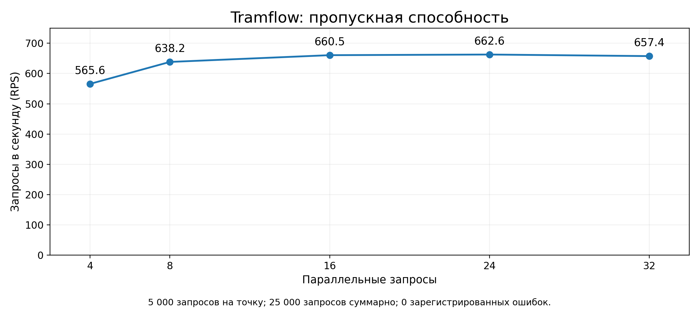
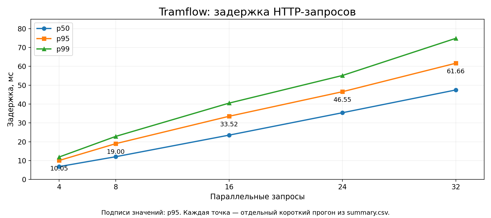

# Tramflow: результаты HTTP-бенчмарка

Источник: результаты предыдущего запуска, предоставленные пользователем в чате. Новый нагрузочный тест при подготовке этого отчёта не проводился.

## Краткий итог

В пяти коротких нагрузочных прогонах выполнено суммарно 25 000 HTTP-запросов. Счётчик ошибок нагрузочного клиента равен нулю во всех прогонах. Максимальная наблюдаемая пропускная способность — 662,64 запроса/с при параллельности 24; p95 — 46,555 мс, p99 — 55,162 мс. При параллельности 16 получено 660,52 запроса/с с p95 33,522 мс. При параллельности 32 p95 составил 61,659 мс.

| Параллельность | Запросы | RPS | p50, мс | p95, мс | p99, мс | Ошибки | Длительность, с |
|---:|---:|---:|---:|---:|---:|---:|---:|
| 4 | 5000 | 565.64 | 6.820 | 10.053 | 11.897 | 0 | 8.840 |
| 8 | 5000 | 638.21 | 12.068 | 18.999 | 22.854 | 0 | 7.834 |
| 16 | 5000 | 660.52 | 23.517 | 33.522 | 40.510 | 0 | 7.570 |
| 24 | 5000 | 662.64 | 35.408 | 46.555 | 55.162 | 0 | 7.546 |
| 32 | 5000 | 657.43 | 47.479 | 61.659 | 74.881 | 0 | 7.605 |

## Графики

## Что измерено

Каждый основной прогон содержит 5 000 запросов и длится приблизительно 7,5–8,8 секунды. Это короткий тест производительности, а не длительный soak-тест. При увеличении параллельности с 16 до 32 RPS остаётся примерно на одном уровне, а задержка растёт. Повторных прогонов для оценки разброса нет; по этим данным нельзя установить причину ограничения пропускной способности.

## Подтверждённый контекст

В приложенном исходном JSON для c=16 указаны target `http://api:8080`, snapshot `demo-september-2026-v1`, маршрут `demo-01`, view_mode `day`, resolution `hour`, spatial_detail `route`. Дата результата c=16: `2026-09-27T11:43:08.798095496Z`. Адрес target относится к прямому обращению к API, а не к внешнему nginx-gateway. Полные JSON для остальных четырёх основных прогонов не предоставлены; их показатели перенесены из summary.csv.

Клиент нагрузки: Linux / amd64 / Go 1.26.8; client_cpus=8. Это число процессоров, сообщённое клиентом, а не лимит CPU backend. Характеристики сервера и БД, Docker CPU/RAM limits, commit и digest образа в предоставленных результатах отсутствуют.

## Smoke

Отдельный smoke: 10 запросов, параллельность 1, errors=0, p95=5,254 мс, длительность 0,047987126 с. Его RPS не используется как оценка устойчивой производительности и не входит в 25 000 запросов основного бенчмарка.

## Ограничения

Результаты относятся к ранее измеренному демо-сценарию. Соответствие текущей сборке dev не подтверждено. Синтетические фикстуры не подтверждают качество ML-модели. CPU/RAM API, отдельная задержка ONNX, длительная стабильность, отсутствие утечек памяти, холодный старт, cache hit ratio и успешность через внешний gateway этим набором данных не установлены. Файлы environment.txt и system.csv упоминаются в исходной сводке, но их содержимое не предоставлено.

Источник PNG-графиков — агрегаты summary.csv, не временные ряды Grafana. На предоставленном скриншоте CPU/RSS/goroutines подписаны postgres-exporter:9187; их нельзя выдавать за ресурсы API.
